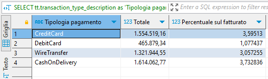

# Database

> _Crea uno UML con articoli magazzino e transazioni. Assicurati di definire la tipologia di relazione tra le tabelle e la tipologia di dato e di key._


Link a [Diagramma ER](https://dbdiagram.io/d/SPS-Assignment-661fa44f03593b6b61385d61)

Alcune considerazioni:

- come punto di partenza ho usato il classico [Oracle Sample Database](https://www.oracletutorial.com/getting-started/oracle-sample-database/) a cui ho fatto delle aggiunte per accomodare il nostro caso d'uso.
- sono state eliminate dal diagramma le tabelle inutilizzate ai fini dell'esercizio a favore di una ridotta complessità e maggior chiarezza. Le entità sono rimaste in forma di commento nella parte DBML ad eventuale uso futuro.

Nel modellare il database o fatto alcune assunzioni che riporto qui:

- trovo che abbia senso separare le entità `orders` e `invoices` dato che sono pertengono a contesti diversi, il primo alla logistica e il secondo alla contabilità. Usando una sola entità si creerebbe inutile confusione che ho preferito evitare - e.g. perchè dovrei mettere nella stessa tabella informazioni su costo e prezzo quando queste due informazioni potrebbero essere disaccoppiate?
- `product_color` è stato definito come attributo della tabella `products` per brevità e per contenere la complessità dell'esercizio. Qualora in produzione emergesse un caso d'uso in cui si rende necessaria un'altra soluzione (enum/altra tabella `product_colors`/etc.) si potrebbe ri-fattorizzare l'entità con relativamente poco sforzo.

Fornisco anche dei file SQL per riprodurre il database modellato in `MySQL`.

Per praticità, ho popolato le tabelle con dati generati partendo dalle tabelle già presenti e che quindi non rappresentano sempre da casi d'uso reali. Per esempio, è inverosimile che `invoices.invoice_date` sia uguale a `orders.order_date` and `financial_transactions.transaction_date` ma questi dati non sono rilevanti per il task

---

> _Scrivi una query che ritorna la percentuale di fatturato proveniente da ordini effettuati con contrassegno rispetto ai pagamenti online, per gli articoli di colore NERO. Solo se in magazzino sono disponibili._

```sql
SELECT
	tt.transaction_type_description as 'Tipologia pagamento',
	SUM(ili.product_quantity * ili.product_price) as 'Totale',
	(
		SUM(ili.product_quantity * ili.product_price) / (SELECT SUM(i_ili.product_quantity * i_ili.product_price) FROM sps.invoice_line_items i_ili)
	) * 100 AS 'Percentuale sul fatturato'
FROM sps.invoices i
JOIN sps.invoice_line_items ili  ON i.invoice_id = ili.invoice_number
JOIN sps.financial_transactions ft ON ft.invoice_number = i.invoice_id
JOIN sps.transaction_types tt ON tt.transaction_type_code = ft.transaction_type_code
WHERE
	1 = 1
  -- decommentare la condizione seguente per mostrare solo gli ordini pagati con contrassegno
	-- AND ft.transaction_type_code IN (
	-- 	SELECT transaction_type_code
	-- 	FROM transaction_types tt
	-- 	WHERE transaction_type_description = 'CashOnDelivery'
	-- )
	-- prodotti disponibili in magazzino
	AND ili.product_id IN (
		SELECT DISTINCT product_id
		FROM sps.inventories i
		WHERE quantity > 0
	)
	-- prodotti colore nero
	AND ili.product_id IN (
		SELECT DISTINCT p.product_id
		FROM sps.products p
		WHERE product_color = 'black'
	)
GROUP BY tt.transaction_type_description
;
```

Eseguita sul DB fornito produce questo risultato (`CashOnDelivery` = contrassegno):

